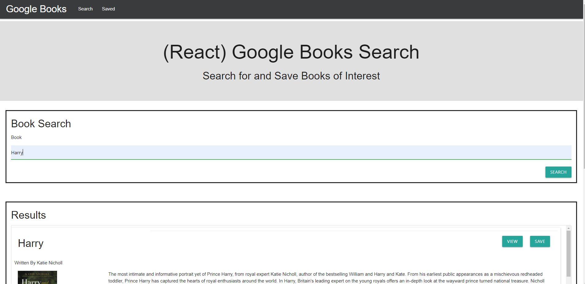

# GoogleBooksSearch

## Table of Contents

1. [Description](#Description)
2. [Criteria](#Criteria)
3. [Installation](#Installation)
4. [Usage](#Usage)
5. [Contributing](#Contributing)
6. [Issues](#Issues)
7. [Credits](#Credits)
8. [License](#License)
9. [Questions](#Questions)

## Description

Our task was to create an application that connects to an external API (Google Books in this case) and a server-side API (I used MongoDB) to search for books on Google and allow the user to save the books to a "Saved" page. The saved books can also be deleted from the list.

I had a weird time getting the API server to connect. I tried adding secure: false to the proxy in the client-side package.json, but it just broke it since proxy can't take an object, apparently, so I removed it and suddenly it worked. I'm really not sure why it fixed itself to be completely honest!

I stuck to the mock-ups as closely as possible, but I added some grays to make the header and hero be a little more interesting.

We were given the option to also use a different CSS framework than Bootstrap, so I used Materialize.

[Deployed website](https://quiet-books-search.herokuapp.com/)

Example pictures:

## Criteria

* This application requires at minimum 2 pages, check out the following mockup images for each page:

  * [Search](./client/public/images/Search.png) - User can search for books via the Google Books API and render them here. User has the option to "View" a book, bringing them to the book on Google Books, or "Save" a book, saving it to the Mongo database.

  * [Saved](./client/public/images/Saved.png) - Renders all books saved to the Mongo database. User has an option to "View" the book, bringing them to the book on Google Books, or "Delete" a book, removing it from the Mongo database.

1. Start by using the 01-Ins_Mern/create-react-express example as a base for your application.

2. Add code to connect to a MongoDB database named `googlebooks` using the mongoose npm package.

3. Using mongoose, then create a Book schema.

4. At a minimum, books should have each of the following fields:

* `title` - Title of the book from the Google Books API

* `authors` - The books's author(s) as returned from the Google Books API

* `description` - The book's description as returned from the Google Books API

* `image` - The Book's thumbnail image as returned from the Google Books API

* `link` - The Book's information link as returned from the Google Books API

5. Create a layout similar to the mockups displayed above. This should be a SPA (Single Page Application) that uses `react-router-dom` to navigate, hide and show your React components without changing the route within Express.

* The layout should include at least two React Components for each page `Search` and `Saved`.

* Feel free to try out alternative CSS framework to Bootstrap.

6. Add the following Express routes for your app:

* `/api/books` (get) - Should return all saved books as JSON.

* `/api/books` (post) - Will be used to save a new book to the database.

* `/api/books/:id` (delete) - Will be used to delete a book from the database by Mongo `_id`.

* `*` (get) - Will load your single HTML page in `client/build/index.html`. Make sure you have this _after_ all other routes are defined.

* Deploy your application to Heroku once complete. **You must use Create React App** and current versions of React and React-Router-Dom for this assignment.

## Installation

Files must be downloaded from Github. Then run npm install to get the necessary node modules. Lastly run npm start.

A ready version is also available at the [deployed website.](https://quiet-books-search.herokuapp.com/)

## Usage

The user can search for books and it will bring up the results in the section below. The user can view the book, which will take them to the google page for the book, or save the book. On the Saved page, the user can see their saved books. Here, they can also view the book like on the search page or they can delete it from the list of saved books.

## Contributing

For contributions, please create a fork to work on then, when done, create a Pull Request.

## Issues

Submit an Issue through Github for any bugs or problems.

## Credits

Assignment was developed as part of the SMU Coding Bootcamp.

## License

Copyright Ashley Wright 2021

This is covered under the <a href='https://opensource.org/licenses/ISC'>ISC</a> license.

## Questions

Feel free to contact through the following with any questions:

Email: ashleyaggie@aol.com

Github: <a href='https://github.com/ashleyaggie'>ashleyaggie</a>